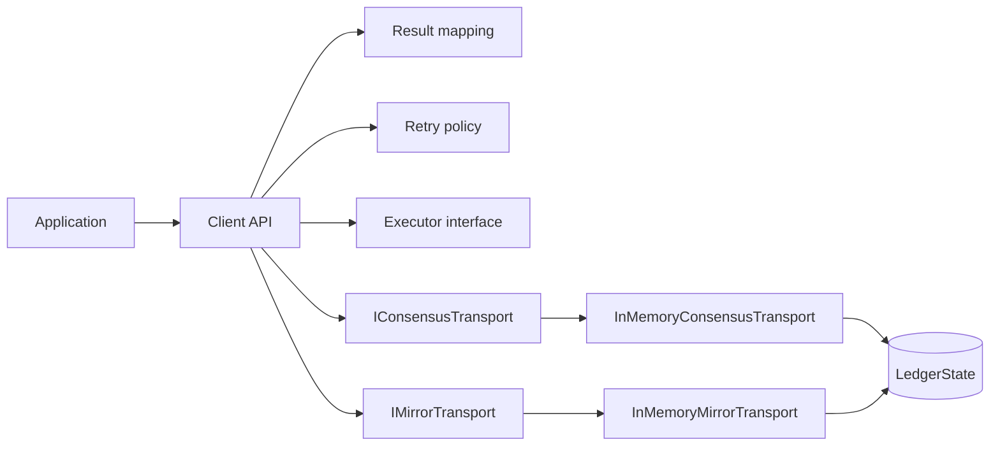
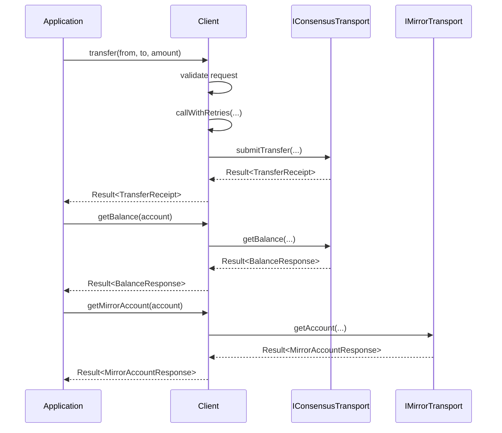

# Architecture: Current Prototype and Next Steps

## 1) Purpose

This file documents:
- the current architecture implemented in this repository
- what is intentionally out of scope for the first prototype
- concrete next steps for expanding toward a fuller V3 SDK design

---

## 2) Current architecture (implemented)

The prototype follows a layered model:

1. Public API layer
- `Client` facade
- `Result<T>` success/error return type
- typed request/response models (`TransferRequest`, `BalanceRequest`, `MirrorAccountRequest`, etc.)

2. Runtime layer
- retry-aware execution path inside `Client`
- pluggable executor interface
- `SingleThreadExecutor` for async task dispatch

3. Transport abstraction layer
- `IConsensusTransport`
- `IMirrorTransport`

4. Prototype backend layer
- `InMemoryConsensusTransport`
- `InMemoryMirrorTransport`
- shared `LedgerState` for deterministic tests and demos

### Component diagram

---

## 3) Request flow (current)

### Transfer and follow-up reads

---

## 4) Current design choices

1. Stable public contract first
- Public API uses typed models and `Result<T>` rather than exposing backend protocol types.

2. Transport isolation
- Consensus and mirror paths are represented as interfaces so backend implementations can change without breaking API shape.

3. Async abstraction
- Async methods use an executor interface rather than hard-coding `std::async` as the only execution model.

4. Testability by design
- In-memory backend allows deterministic unit and integration-style tests for the first vertical slice.

---

## 5) Current limitations

- No real network transport adapters yet (in-memory only).
- Retry policy is minimal and currently based on broad error categories.
- Error code set is intentionally small.
- No wire-level serialization/protobuf mapping in this repository yet.
- No production security model (key storage, signing service integration, etc.) in this first slice.

---

## 6) Next steps roadmap

### Phase A: transport and protocol integration
- add real consensus adapter behind `IConsensusTransport`
- add real mirror adapter behind `IMirrorTransport`
- keep protocol-specific classes private to adapter implementation

### Phase B: API expansion
- add at least one additional transaction family
- add additional query family
- standardize request builder patterns where needed

### Phase C: runtime hardening
- refine retry taxonomy and backoff behavior
- add explicit timeout/deadline handling in runtime policy
- expand async strategy options (single thread, thread pool, external scheduler)

### Phase D: quality and compatibility
- add transport contract tests
- add failure-mode matrix tests
- define non-breaking evolution policy (deprecation and versioning guidance)

### Phase E: documentation and upstream contribution
- propose C++ guideline improvements in `sdk-collaboration-hub`
- provide evidence-backed examples from prototype behavior
- align docs with parity-template baseline expectations

---

## 7) Short-term milestone (what success looks like next)

Next milestone is successful when:
- real transport adapter interfaces are wired (or mocked to exact contracts)
- one additional transaction/query is added without API churn
- test coverage includes retry and async failure scenarios
- documentation updates include concrete before/after proposals upstream
